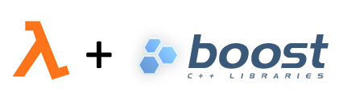

# C++ runtime for AWS lambda

Repo containing the Dockerfile of my image used to build AWS Lambda running c++.

```
Subfolders structure
 |- cpp_tuto
 |- boost_tuto
```

## Docker

To pull the docker image from dockerhub

```
docker pull ppjmartins/aws_cpp_lambda:latest
```

To build the docker image

```
docker build -t ppjmartins/aws_cpp_lambda:latest .
```

To push a new tagged image to dockerhub

```
docker push ppjmartins/aws_cpp_lambda:latest
```


## C++ Tutorial

Run the image and attach a volume so we can interact with it.
Once inside the container, move to the `cpp_tuto` folder.

```
docker run --rm -ti --name=aws_cpp_lambda  -v $PWD/cpp_tuto:/cpp_tuto ppjmartins/aws_cpp_lambda:latest /bin/bash;
cd cpp_tuto
```

## Boost Graph Tutorial

Similarly to the c++ tutorial, run the aws_cpp_lambda image and once inside the container move to `boost_tuto`.

```
docker run --rm -ti --name=aws_cpp_lambda  -v $PWD/boost_tuto:/boost_tuto ppjmartins/aws_cpp_lambda:latest /bin/bash;
cd boost_tuto
```


